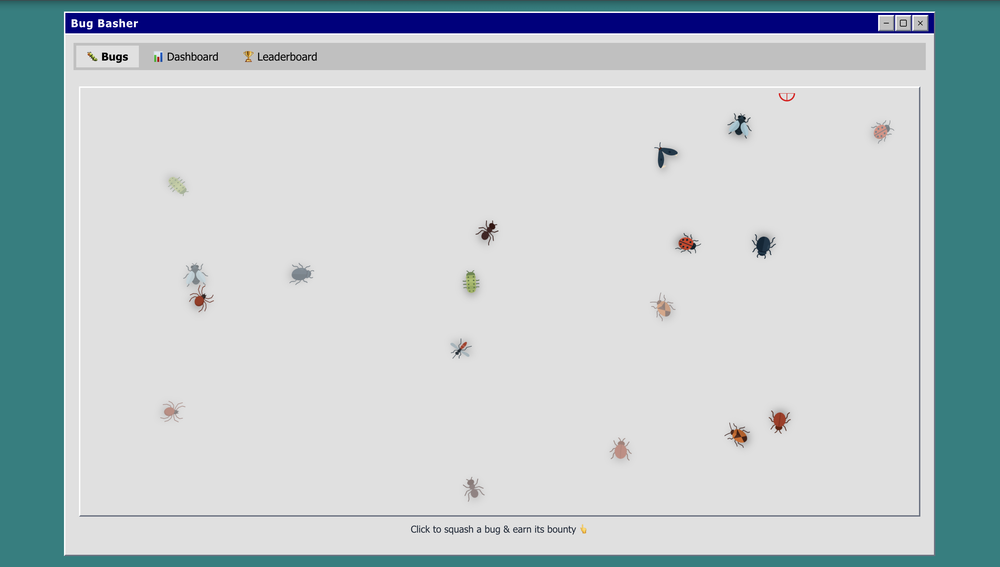

# Bug Basher

A retro-inspired bug-squashing game and dashboard, built with React, TypeScript, and Vite. Inspired by Windows 95 aesthetics, Bug Basher lets you squash animated bugs, track your bounty, and compete on the leaderboard!



---

## Features

- **Interactive Bug Squashing**: Click or use keyboard/gamepad to squash animated bugs.
- **Leaderboard**: Compete for the highest bounty by squashing the most bugs.
- **Dashboard**: Visualize bug stats, trends, and your progress.
- **File New Bugs**: Add new bugs with custom bounties and priorities.
- **Retro UI**: Windows 95-inspired design for a nostalgic experience.

## Getting Started

1. **Install dependencies:**
   ```bash
   npm install
   ```
2. **Run the development server:**
   ```bash
   npm run dev
   ```
3. **Open in your browser:**
   Visit [http://localhost:5173](http://localhost:5173)

## Project Structure

- `src/components/` — UI components (BugArea, BugCrawler, BugCard, etc.)
- `src/routes/` — Main app routes (Bugs, Dashboard, Leaderboard, etc.)
- `src/store.ts` — State management using Zustand
- `src/assets/` — Bug images and icons
- `public/` — Static assets (including screenshot)

## Main Components

- **BugArea**: Handles bug layout, aim/cursor, and input (mouse, keyboard, gamepad).
- **BugCrawler**: Animates individual bugs and handles interactions.
- **BugCard**: Displays bug details and allows squashing.
- **Dashboard**: Shows bug stats, trends, and activity.
- **Leaderboard**: Ranks users by bounty and efficiency.

## Controls

- **Mouse**: Move cursor and click to squash bugs.
- **Keyboard**: WASD to move aim, Space to squash.
- **Gamepad**: Left stick to aim, A/trigger to squash.

## Contributing

Pull requests are welcome! For major changes, please open an issue first to discuss what you would like to change.

---

© 2024 Bug Basher. All rights reserved.
